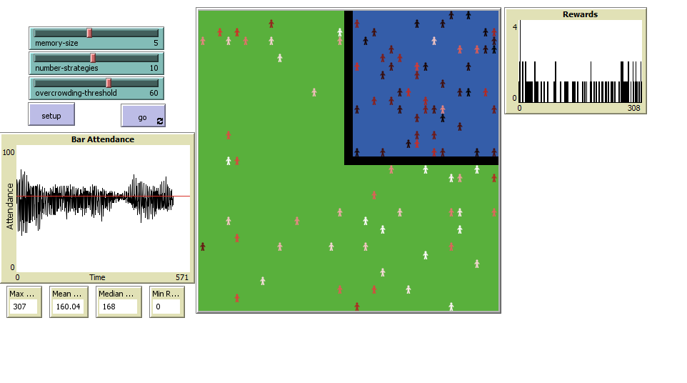
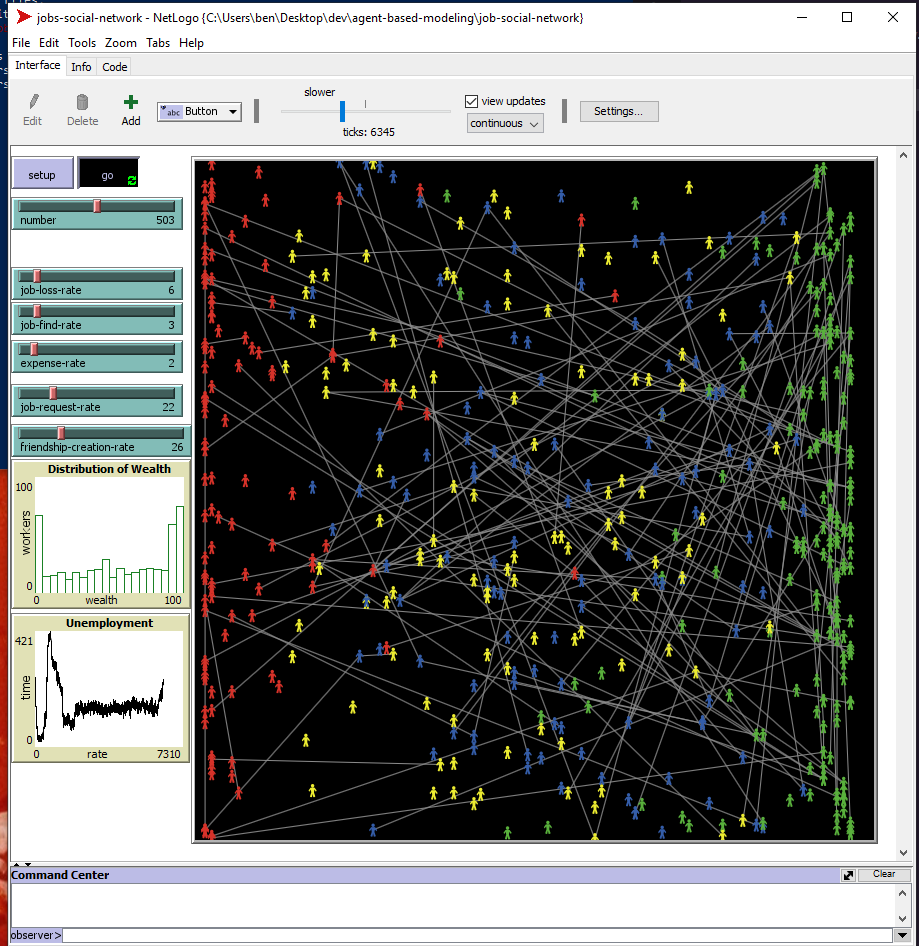
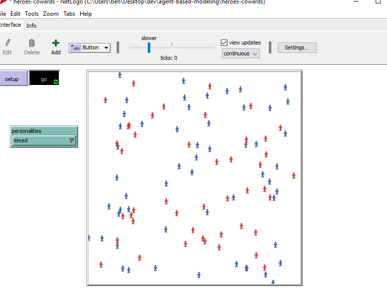
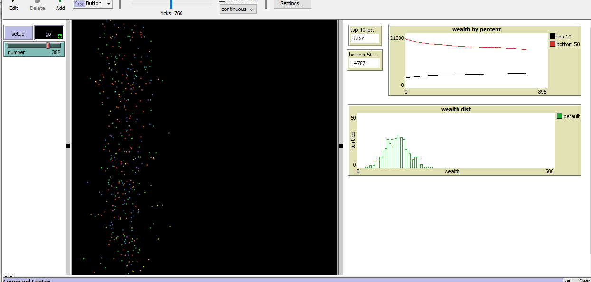
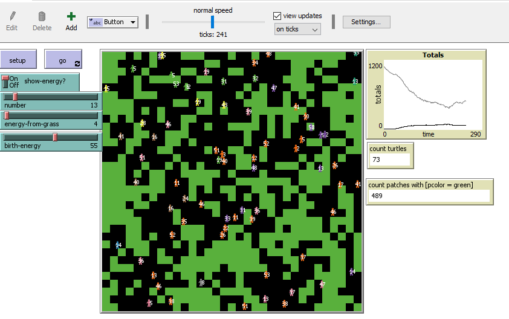

# agent-based-modeling
Storing work from ABM study from Intro to ABM via Santa Fe Institute.

Below, my work / progress through the study is documented, newest project to oldest from the top.

## El Farol Extended

Extention of the El Farol model to build rewards system and monitoring around the model.

## Job Social Network ABM

Part of NetLogo training the task was to create a simulation to see what happens in a simple job market.

* The x position of each agent represents their wealth 0-100
* Each tick, agents are deducted living expenses
* Each tick, agent earns income if they have a job
* Agents lose or find jobs on their own at rates set by job-loss-rate and job-find-rate sliders
* If an agent has a job for more than 5 ticks, they create a friend (who is also employed). The rate of friendships being created this way is controlled by a slider that one can adjust
* Friendships are lost over time
* If agent is unemployed, it can ask a current friend that has high wealth for a job (at the same rate as their friend). The rate of them getting a job this way is set by a slider that one can adjust
* Agents change color based on being poor (less than 10 wealth), being wealth (more than 90), having a job, or being unemployed
* Social connections are labeled with links

## Heroes and Cowards ABM

Recreating the Heroes And Cowards Activity as an ABM

* Each agent is either a hero or a coward
* Each agent selects one other agent to be his friend, and another agent to be his enemy
* If an agent is a hero, he will attempt to get between his enemy and his friend
* If agent is a coward, he will attempt to put his friend between himself and his enemy

## Simple Economy

Warming up, creating a simple model to understand wealth distribution.

* Created simple economy model and charting
* Analyzed results with BehaviorSpace

## Tutorial - Grass Eaters

Simple tutorial following netlogo default tutorial

* agents move randomly
* if there's grass, agent eats it to get energy
* agent has chance of reproducing.
* if patch has no grass, it has a chance of growing back
